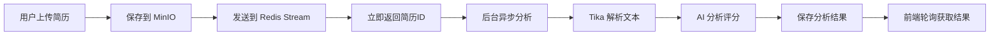
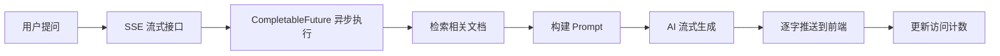

# 智能面试助手 (Smart Interview Assistant)

> 🎯 基于 [Snailclimb/interview-guide](https://github.com/Snailclimb/interview-guide) 二次开发 | 全栈项目 | 用于技术面试展示

[](https://openjdk.org/)
[](https://spring.io/projects/spring-boot)
[](https://react.dev/)
[](https://www.postgresql.org/)
[](https://redis.io/)
[](https://github.com/Snailclimb/interview-guide/blob/main/LICENSE)

---

## 📜 项目说明

本项目基于开源项目 [Snailclimb/interview-guide](https://github.com/Snailclimb/interview-guide) 进行二次开发，在原项目基础上进行了以下优化和改进：

### 🛠️ 主要改进

1. **代码质量优化**
   - 枚举替代魔法字符串（SessionStatus、EvaluateStatus）
   - 统一异常处理（BusinessException + GlobalExceptionHandler）
   - 提取常量，消除硬编码

2. **功能增强**
   - 面试评估异步化（Redis Stream）
   - 白卷处理机制（允许交白卷，生成零分报告）
   - 前后端数据结构对齐修复
   - 面试详情页完整展示

3. **稳定性提升**
   - Redis 连接断开自动重试
   - PDF 解析超时控制（30秒）
   - AI 调用重试机制（指数退避）
   - 线程池优雅关闭

4. **工程实践**
   - 环境变量配置化（.env.example）
   - Docker Compose 一键部署
   - 完善的日志系统

---

## ✨ 技术亮点

- 🔄 **异步任务队列**：使用 Redis Stream 实现可靠的异步处理，支持断点续传
- 🌊 **流式响应**：SSE 实时推送 AI 回答，提升用户体验
- 🛡️ **容错机制**：完善的异常处理、超时控制、重试机制
- 📊 **智能评估**：AI 生成多维度评估报告，支持个性化出题
-  **代码质量**：枚举消除魔法值、全局异常处理、统一响应格式
-  **工程实践**：Docker 容器化、线程池优雅关闭、配置化管理

---

## 📋 项目简介

这是一个全栈智能面试助手系统，集成了 **AI 简历分析**、**模拟面试**、**知识库问答**等核心功能，旨在帮助求职者：

- 📄 **智能解析简历**：自动提取简历关键信息并给出评分和建议
- 🎤 **模拟真实面试**：基于岗位需求生成个性化面试题，支持文字和语音面试
- 📚 **知识库管理**：上传技术文档，构建个人知识体系，支持智能问答
- 📊 **详细评估报告**：AI 生成多维度评估报告，指出优缺点和改进方向

### 核心技术亮点

- ✨ **异步任务处理**：使用 Redis Stream 实现可靠的异步任务队列
- 🔄 **断点续传**：应用重启后自动恢复未完成的分析任务
- 🌊 **流式响应**：SSE 实时推送 AI 回答，提升用户体验
- 🛡️ **容错机制**：完善的异常处理和降级策略

---

## 🏗️ 项目架构

### 整体架构图

```
┌─────────────────────────────────────────────────────────────┐
│                      Frontend (React)                        │
│  ┌──────────┐ ┌──────────┐ ┌──────────┐ ┌──────────────┐  │
│  │ 简历管理  │ │模拟面试   │ │知识库    │ │面试记录      │  │
│  └──────────┘ └──────────┘ └──────────┘ └──────────────┘  │
└──────────────────────┬──────────────────────────────────────┘
                       │ HTTP/WebSocket
┌──────────────────────▼──────────────────────────────────────┐
│                   Backend (Spring Boot)                      │
│  ┌──────────────────────────────────────────────────────┐  │
│  │              Controller Layer                         │  │
│  │  ResumeController | InterviewController | ...        │  │
│  └──────────────────────────────────────────────────────┘  │
│  ┌──────────────────────────────────────────────────────┐  │
│  │              Service Layer                            │  │
│  │  ResumeService | InterviewService | ...              │  │
│  └──────────────────────────────────────────────────────┘  │
│  ┌──────────────────────────────────────────────────────┐  │
│  │          Infrastructure Layer                         │  │
│  │  Redis Stream | MinIO | AI ChatClient                │  │
│  └──────────────────────────────────────────────────────┘  │
└──────┬────────────────────┬───────────────────┬────────────┘
       │                    │                   │
  ┌────▼─────┐      ┌──────▼──────┐    ┌──────▼──────┐
  │PostgreSQL│      │   Redis     │    │   MinIO     │
  │ Database │      │  Stream     │    │  Storage    │
  └──────────┘      └─────────────┘    └─────────────┘
```

### 模块划分

```
my-interview/
├── app/                          # Spring Boot 后端
│   ├── src/main/java/com/edu/muc/app/
│   │   ├── common/               # 通用模块
│   │   │   ├── config/           # 配置类
│   │   │   ├── exception/        # 异常处理
│   │   │   └── util/             # 工具类
│   │   ├── infrastructure/       # 基础设施层
│   │   │   ├── file/             # 文件存储（MinIO）
│   │   │   └── redis/            # Redis 消息队列
│   │   └── modules/              # 业务模块
│   │       ├── resume/           # 简历管理
│   │       ├── interview/        # 模拟面试
│   │       ├── knowledgebase/    # 知识库管理
│   │       ├── ragchat/          # RAG 聊天
│   │       └── voiceinterview/   # 语音面试
│   └── src/main/resources/
│       ├── prompts/              # AI 提示词模板
│       └── application.yml       # 配置文件
│
├── frontend/                     # React 前端
│   ├── src/
│   │   ├── api/                  # API 接口封装
│   │   ├── components/           # 公共组件
│   │   ├── pages/                # 页面组件
│   │   ├── hooks/                # 自定义 Hooks
│   │   ├── types/                # TypeScript 类型定义
│   │   └── utils/                # 工具函数
│   └── package.json
│
└── docker-compose.yml            # Docker 编排文件
```

---

## 📦 核心模块详解

### 1️⃣ Common 模块 - 通用基础

**职责**：提供全局通用的配置、异常处理和工具类

#### 📁 目录结构
```
common/
├── config/
│   ├── AiConfig.java            # AI 客户端配置
│   ├── CorsConfig.java          # CORS 跨域配置
│   └── WebConfig.java           # Web 配置
├── exception/
│   ├── BusinessException.java   # 业务异常类
│   └── GlobalExceptionHandler.java  # 全局异常处理器
└── Result.java                  # 统一响应结果
```

#### 🔑 关键功能

**统一响应格式**：
```java
{
  "code": 200,
  "message": "success",
  "data": { ... }
}
```

**全局异常处理**：
- 业务异常 → 400 Bad Request
- 系统异常 → 500 Internal Server Error
- 生产环境隐藏堆栈信息

---

### 2️⃣ Infrastructure 模块 - 基础设施

**职责**：封装外部依赖（Redis、MinIO），提供统一接口

#### 📁 目录结构
```
infrastructure/
├── file/
│   ├── FileStorageService.java      # 文件存储接口
│   └── MinioFileStorageService.java # MinIO 实现
└── redis/
    ├── RedisStreamProducer.java     # Stream 生产者
    └── RedisConfig.java             # Redis 配置
```

#### 🔑 关键功能

**Redis Stream 异步任务队列**：
```java
// 发送任务
streamProducer.sendResumeAnalysisTask(resumeId);
streamProducer.sendInterviewEvaluationTask(sessionId);

// 消费者监听
- ResumeAnalysisConsumer      // 简历分析消费者
- InterviewEvaluationConsumer // 面试评估消费者
```

**特性**：
- ✅ 消息持久化，应用重启不丢失
- ✅ 消费者组模式，支持水平扩展
- ✅ 自动重试和失败恢复
- ✅ 优雅关闭机制

---

### 3️⃣ Resume 模块 - 简历管理

**职责**：简历上传、解析、分析和评分

#### 📁 目录结构
```
resume/
├── controller/
│   └── ResumeController.java
├── domain/
│   ├── Resumes.java              # 简历实体
│   └── ResumeAnalyses.java       # 分析结果实体
├── mapper/
│   ├── ResumesMapper.java
│   └── ResumeAnalysesMapper.java
├── service/
│   ├── ResumesService.java
│   ├── ResumeAnalysisConsumer.java  # 异步消费者
│   └── impl/
└── dto/
    ├── ResumeListItemDTO.java
    └── ResumeDetailDTO.java
```

#### 🔄 工作流程



#### ✨ 核心特性

1. **异步分析**：上传后立即返回，后台慢慢处理
2. **断点续传**：应用重启后自动恢复未完成的任务
3. **智能评分**：从多个维度评估简历质量
4. **去重机制**：基于 MD5 避免重复上传

---

### 4️⃣ Interview 模块 - 模拟面试

**职责**：生成面试题、答题、评估报告

#### 📁 目录结构
```
interview/
├── controller/
│   └── InterviewController.java
├── domain/
│   ├── InterviewSession.java     # 面试会话
│   ├── InterviewQuestion.java    # 面试问题
│   └── InterviewAnswer.java      # 用户答案
├── enums/
│   ├── SessionStatus.java        # 会话状态枚举
│   └── EvaluateStatus.java       # 评估状态枚举
├── mapper/
│   ├── InterviewSessionMapper.java
│   ├── InterviewQuestionMapper.java
│   └── InterviewAnswerMapper.java
├── service/
│   ├── InterviewService.java
│   ├── InterviewEvaluationConsumer.java  # 评估消费者
│   └── impl/
└── dto/
    ├── CreateInterviewRequest.java
    ├── InterviewSessionDTO.java
    └── InterviewReportDTO.java
```

#### 🔄 工作流程

**创建面试**：
```
用户选择技能和难度
    ↓
AI 生成个性化面试题
    ↓
保存到数据库
    ↓
返回会话 ID
```

**答题流程**：
```
获取当前问题
    ↓
用户提交答案
    ↓
保存到数据库
    ↓
推进到下一题
    ↓
如果是最后一题 → 自动触发评估
```

**评估流程**：
```
交卷或答完所有题
    ↓
发送评估任务到 Redis Stream
    ↓
InterviewEvaluationConsumer 接收
    ↓
查询问题和答案
    ↓
如果有答案 → AI 评估
    ↓
如果白卷 → 生成零分报告
    ↓
保存评估结果
    ↓
前端轮询获取报告
```

#### ✨ 核心特性

1. **个性化出题**：根据简历和岗位生成针对性问题
2. **追问机制**：根据回答质量动态调整后续问题
3. **异步评估**：交卷后立即返回，后台生成报告
4. **白卷处理**：允许交白卷，生成建设性的零分报告
5. **状态管理**：使用枚举管理会话和评估状态

---

### 5️⃣ KnowledgeBase 模块 - 知识库管理

**职责**：文档上传、分块、向量化、检索

#### 📁 目录结构
```
knowledgebase/
├── controller/
│   └── KnowledgeBaseController.java
├── domain/
│   └── KnowledgeDocument.java    # 文档实体（含向量）
├── service/
│   ├── KnowledgeDocumentService.java
│   ├── SmartRetrievalService.java  # 智能检索
│   └── impl/
└── dto/
    ├── KnowledgeBaseStats.java
    └── QueryRequest.java
```

#### 🔄 工作流程

**文档上传**：
```
上传 PDF/Word/TXT
    ↓
Tika 解析文本
    ↓
智能分块（保留上下文）
    ↓
向量化（Embedding）
    ↓
存储到 PostgreSQL（pgvector）
```

**智能检索**：
```
用户提问
    ↓
问题向量化
    ↓
向量相似度搜索
    ↓
过滤低相似度结果
    ↓
返回相关文档片段
```

#### ✨ 核心特性

1. **智能分块**：在句子边界处截断，保留 20% 重叠
2. **向量检索**：基于余弦相似度的语义搜索
3. **来源标注**：回答时引用具体文档来源
4. **统计信息**：文档数量、分类、访问次数等

---

### 6️⃣ RAG Chat 模块 - 知识库问答

**职责**：基于知识库的流式对话

#### 📁 目录结构
```
ragchat/
├── controller/
│   └── RagChatController.java
├── domain/
│   ├── ChatSession.java          # 聊天会话
│   └── ChatMessage.java          # 聊天消息
├── service/
│   ├── RagChatService.java
│   └── impl/
└── dto/
    ├── CreateSessionRequest.java
    └── SendMessageRequest.java
```

#### 🔄 工作流程



#### ✨ 核心特性

1. **流式响应**：SSE 实时推送，用户体验好
2. **会话管理**：支持多轮对话，保持上下文
3. **异步处理**：不阻塞主线程
4. **引用来源**：回答中标注参考文档

---

### 7️⃣ VoiceInterview 模块 - 语音面试

**职责**：语音识别、语音合成、实时对话

> ⚠️ 此模块为预留模块，暂未完全实现

---

## 🛠️ 技术栈

### 后端技术

| 技术 | 版本 | 用途 |
|------|------|------|
| Java | 17 | 编程语言 |
| Spring Boot | 3.4 | Web 框架 |
| MyBatis-Plus | 3.5.x | ORM 框架 |
| PostgreSQL | 16 | 关系数据库 |
| pgvector | 0.5+ | 向量存储扩展 |
| Redis | 7 | 缓存 + 消息队列 |
| MinIO | Latest | 对象存储 |
| Spring AI | 1.0.x | AI 集成框架 |
| Apache Tika | 2.x | 文档解析 |
| Lombok | 1.18.x | 代码简化 |

### 前端技术

| 技术 | 版本 | 用途 |
|------|------|------|
| React | 18.x | UI 框架 |
| TypeScript | 5.x | 类型安全 |
| Vite | 5.x | 构建工具 |
| Tailwind CSS | 3.x | 样式框架 |
| Axios | 1.x | HTTP 客户端 |
| Framer Motion | 10.x | 动画库 |
| Lucide React | Latest | 图标库 |

### DevOps

| 技术 | 用途 |
|------|------|
| Docker | 容器化 |
| Docker Compose | 服务编排 |
| Nginx | 反向代理（可选） |

---

## 🚀 快速开始

### 前置要求

- Java 17+
- Node.js 18+
- Docker & Docker Compose
- Git

### 1. 克隆项目

```bash
git clone <repository-url>
cd my-interview
```

### 2. 配置环境变量

在项目根目录创建 `.env` 文件：

```bash
# 通义千问 API Key（必填）
DASHSCOPE_API_KEY=your-api-key-here

# AI 模型（可选，默认 qwen-plus）
AI_MODEL=qwen-plus

# 数据库密码（可选，默认 password）
POSTGRES_PASSWORD=password

# 面试配置（可选）
APP_INTERVIEW_FOLLOW_UP_COUNT=1
APP_INTERVIEW_EVALUATION_BATCH_SIZE=8
```

### 3. 启动服务

```bash
# 启动所有服务（PostgreSQL, Redis, MinIO, Backend）
docker-compose up -d 

# 查看日志
docker-compose logs -f app
```

### 4. 安装前端依赖

```bash
cd frontend
npm install
# 或
pnpm install
```

### 5. 启动前端开发服务器

```bash
npm run dev
```

### 6. 访问应用

- 前端：http://localhost:5173
- 后端 API：http://localhost:8080
- MinIO 控制台：http://localhost:9001

---

## 📊 数据库设计

### 核心表结构

#### 1. resumes（简历表）
```sql
- id: BIGINT (PK)
- original_filename: VARCHAR
- storage_key: VARCHAR (MinIO 路径)
- resume_text: TEXT (解析后的文本)
- analyze_status: VARCHAR (PENDING/PROCESSING/COMPLETED/FAILED)
- access_count: INT (访问次数)
- created_at: TIMESTAMP
```

#### 2. resume_analyses（简历分析结果表）
```sql
- id: BIGINT (PK)
- resume_id: BIGINT (FK)
- overall_score: INT
- summary: TEXT
- strengths_json: JSONB
- suggestions_json: JSONB
- score_detail_json: JSONB
- analyzed_at: TIMESTAMP
```

#### 3. interview_sessions（面试会话表）
```sql
- session_id: VARCHAR (PK)
- resume_id: BIGINT (FK)
- skill_id: VARCHAR
- difficulty: VARCHAR
- total_questions: INT
- current_question_index: INT
- status: VARCHAR (CREATED/IN_PROGRESS/COMPLETED/EVALUATED)
- evaluate_status: VARCHAR (PENDING/PROCESSING/COMPLETED/FAILED)
- overall_score: INT
- overall_feedback: TEXT
- strengths_json: JSONB
- improvements_json: JSONB
- created_at: TIMESTAMP
- completed_at: TIMESTAMP
- evaluated_at: TIMESTAMP
```

#### 4. interview_questions（面试问题表）
```sql
- id: BIGINT (PK)
- session_id: VARCHAR (FK)
- question_index: INT
- question: TEXT
- type: VARCHAR
- category: VARCHAR
- reference_answer: TEXT
- key_points_json: JSONB
- created_at: TIMESTAMP
```

#### 5. interview_answers（面试答案表）
```sql
- id: BIGINT (PK)
- session_id: VARCHAR (FK)
- question_index: INT
- answer: TEXT
- score: INT
- feedback: TEXT
- created_at: TIMESTAMP
- evaluated_at: TIMESTAMP
```

#### 6. knowledge_documents（知识库文档表）
```sql
- id: BIGINT (PK)
- parent_id: BIGINT (父文档ID，分块后指向原文档)
- name: VARCHAR
- content: TEXT
- category: VARCHAR
- embedding: VECTOR(1536) (向量)
- access_count: INT
- question_count: INT
- created_at: TIMESTAMP
```

---

## 🔧 开发指南

### 后端开发

#### 添加新模块

1. 在 `modules/` 下创建模块目录
2. 按照标准分层结构创建子目录
3. 在 Controller 中定义 REST API
4. 在 Service 中实现业务逻辑
5. 使用 MyBatis-Plus 生成 Mapper

#### 异步任务开发

```java
// 1. 在 RedisStreamProducer 中添加发送方法
public RecordId sendYourTask(String taskId) {
    return redisTemplate.opsForStream().add(
        StreamRecords.newRecord()
            .in("your:task")
            .ofMap(Map.of("taskId", taskId))
    );
}

// 2. 创建消费者
@Component
public class YourTaskConsumer {
    @PostConstruct
    public void start() {
        // 监听 Stream
    }
    
    private void processTask(String taskId) {
        // 处理逻辑
    }
}
```

### 前端开发

#### 添加新页面

1. 在 `pages/` 下创建页面组件
2. 在 `api/` 中定义 API 接口
3. 在 `App.tsx` 中添加路由
4. 在 `types/` 中定义 TypeScript 类型

#### 调用 API

```typescript
import { request } from '@/api/request';

export const yourApi = {
  getData: async () => {
    return request.get('/api/your-endpoint');
  }
};
```

---

## 🧪 测试

### 后端测试

```bash
cd app
mvn test
```

### 前端测试

```bash
cd frontend
npm run test
```

---

## 📈 性能优化

### 已实现的优化

1. **N+1 查询优化**：批量加载关联数据
2. **Redis 缓存**：热点数据缓存
3. **异步处理**：耗时操作异步执行
4. **流式响应**：SSE 减少等待时间
5. **连接池**：数据库和 Redis 连接池

[//]: # ([//]: # &#40;### 待优化项&#41;)
[//]: # ()
[//]: # ([//]: # &#40;&#41;)
[//]: # ([//]: # &#40;- [ ] 添加数据库索引&#41;)
[//]: # ()
[//]: # ([//]: # &#40;- [ ] 实现分页查询&#41;)
[//]: # ()
[//]: # ([//]: # &#40;- [ ] 添加 CDN 加速静态资源&#41;)
[//]: # ()
[//]: # ([//]: # &#40;- [ ] 实现服务端渲染（SSR）&#41;)
[//]: # ()
[//]: # ([//]: # &#40;&#41;)
[//]: # ([//]: # &#40;---&#41;)
[//]: # ()
[//]: # (## 🔐 安全性)

[//]: # ()
[//]: # (### 当前安全措施)

[//]: # ()
[//]: # (- ✅ CORS 配置)

[//]: # (- ✅ 输入验证)

[//]: # (- ✅ SQL 注入防护（MyBatis-Plus）)

[//]: # (- ✅ 文件类型校验)

[//]: # ()
[//]: # (### 待加强项)

[//]: # ()
[//]: # (- [ ] JWT 认证授权)

[//]: # (- [ ] API 限流)

[//]: # (- [ ] XSS 防护)

[//]: # (- [ ] CSRF 防护)

---

## 🐛 常见问题

### 1. Redis 连接失败

**症状**：`RedisConnectionFailureException`

**解决**：
```bash
# 检查 Redis 是否运行
docker ps | grep redis

# 重启 Redis
docker restart interview-redis
```

### 2. AI 调用超时

**症状**：`Read timed out`

**解决**：
- 检查网络连接
- 确认 API Key 正确
- 增加超时时间配置

### 3. 前端白屏

**症状**：访问前端页面显示空白

**解决**：
```bash
# 清除缓存重新安装
cd frontend
rm -rf node_modules package-lock.json
npm install
npm run dev
```

### 4. 数据库迁移失败

**症状**：表不存在

**解决**：
```bash
# 删除数据卷重新启动
docker-compose down -v
docker-compose up -d
```

---

## 📝 更新日志

### v1.0.0 (2026-5-XX)

**新增功能**：
- ✅ 简历上传和智能分析
- ✅ 模拟面试（文字版）
- ✅ 知识库管理和 RAG 问答
- ✅ 异步任务队列（Redis Stream）
- ✅ 断点续传机制
- ✅ 白卷评估处理

**代码质量**：
- ✅ 统一异常处理
- ✅ 枚举消除魔法值
- ✅ 全局异常处理器

---

## 🤝 贡献指南

欢迎提交 Issue 和 Pull Request！

1. Fork 本仓库
2. 创建特性分支 (`git checkout -b feature/AmazingFeature`)
3. 提交更改 (`git commit -m 'Add some AmazingFeature'`)
4. 推送到分支 (`git push origin feature/AmazingFeature`)
5. 开启 Pull Request

---

## 📄 许可证

本项目采用 MIT 许可证 - 详见 [LICENSE](LICENSE) 文件

---

## 👨‍💻 作者

**你的姓名**

- GitHub: [@your-github](https://github.com/your-github)
- Email: your-email@example.com

---

## 🙏 致谢

本项目基于以下开源项目开发：

- **[Snailclimb/interview-guide](https://github.com/Snailclimb/interview-guide)** - 智能面试助手原始项目（AGPL-3.0 License）
- [Spring Boot](https://spring.io/projects/spring-boot)
- [React](https://react.dev/)
- [Spring AI](https://spring.io/projects/spring-ai)
- [通义千问](https://tongyi.aliyun.com/qianwen/)

感谢原作者 Snailclimb 的开源贡献！

---

## 📄 许可证

本项目遵循 **AGPL-3.0 License**（与原始项目保持一致）。

> 基于 [Snailclimb/interview-guide](https://github.com/Snailclimb/interview-guide) 的 AGPL-3.0 许可证。

详见 [LICENSE](LICENSE) 文件。

---

## 📞 联系方式

如有问题或建议，请通过以下方式联系：

- 📧 Email: your-email@example.com
- 💬 Issues: [GitHub Issues](https://github.com/your-repo/issues)

---

<div align="center">

**如果这个项目对你有帮助，请给一个 ⭐ Star！**

Made with ❤️ by [Your Name]

</div>
